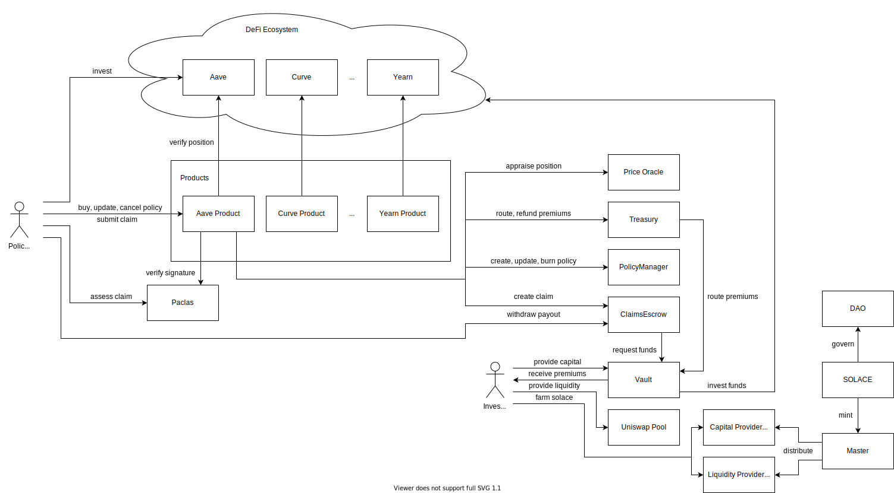

# solace.fi
https://solace.fi

## Contracts
detailed technical documentation is located at https://docs.solace.fi
* :white_check_mark: SolaceToken: solace.fi protocol ERC20 token
* :white_check_mark: Registry: registry contract keeping track of contract addresses and the products mapping deployed by the MultiSig Deployer
* :white_check_mark: Master: SOLACE token distributor (yield farming staking contract)
  * :white_check_mark: CpFarm: distributes rewards to capital providers
  * :white_check_mark: SolaceEthLpFarm: distributes rewards to liquidity providers
* :white_check_mark: Vault: capital pool that backs risk
* :white_check_mark: Treasury: holds and manages the protocol's own capital
* :white_check_mark: Product: abstract contract that's inherited by the products, which will deploy new insurance policies purchased by the buyers
  * :white_check_mark: AaveV2Product: can cover a single Aave V2 position https://aave.com/
  * :white_check_mark: CompoundProduct: can cover a single Compound position https://compound.finance/
  * :white_check_mark: YearnV2Product: can cover a single Yearn V2 position https://yearn.fi/
  * CurveProduct: can cover a single Curve position https://curve.fi/
  * ProtocolProduct: can be purchased by a protocol owner to cover their entire protocol
* :white_check_mark: PolicyManager: an ERC721 contract that stores user-specific policy data, a single touch point between the policy-buyer and the protocol
* :white_check_mark: RiskManager: calculates the acceptable risk for each product
* :white_check_mark: ClaimsEscrow: holds capital and claims until withdrawn by claimant
* :white_check_mark: ExchangeQuoter: price oracle, used to determine position value in ETH

## Pragma Version
* Solidity 0.8.6: https://docs.soliditylang.org/en/v0.8.6/

## Development Stack
* Ethereum Dev Environment: https://hardhat.org/
* Smart Contract Testing: https://getwaffle.io/
* Blockchain interactions: https://docs.ethers.io/v5/
* TypeChain (TypeScript bindings for Ethereum smartcontracts): https://github.com/ethereum-ts/TypeChain
* TypeScript: https://www.typescriptlang.org/

## Style Guide
* Solidity: https://docs.soliditylang.org/en/v0.8.6/style-guide.html
* TypeScript: https://google.github.io/styleguide/tsguide.html
* Git: https://github.com/kseniya292/standards

## License
GNU General Public License v3.0
