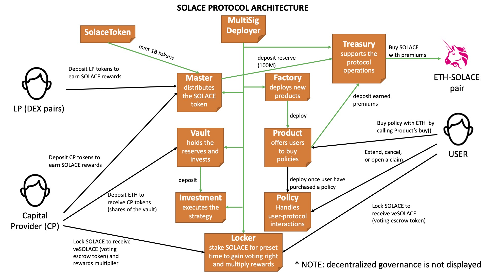

# solace.fi
https://solace.fi

## Contracts
detailed technical documentation is located in docs folder.
* MultiSig: Solace deployer controlled by the core team (use Gnosis Safe?)
* SolaceToken: solace.fi protocol ERC20 token
* Master: owner of solace.fi (ownership will be transferred to decentralized governance in the future) and SOLACE distributor
* Vault: contract that holds the reserve and allocates capital to investment (denominated in ETH)
* Investment: capital pool utilized for investment activity (currently liquid ETH2.0 staking)
* Locker: vote lockup contract to boost rewards for capital providers and gain governance rights
* Treasury: holds and manages the protocol's own capital and buys up SOLACE on the open market (denominated in SOLACE)
* Factory: deploys new insurance products created by the MultiSig
* Product: deploys new insurance policies purchased by the buyers
* Policy: purchased insurance policy
* Router: routes the function calls to the core contracts

## Operational notes
* Use OpenZeppelin Defender for smart contract administration
* Proxy scheme to deploy insurance policies (one implementation per product, one proxy per user)
*
## License
MIT
