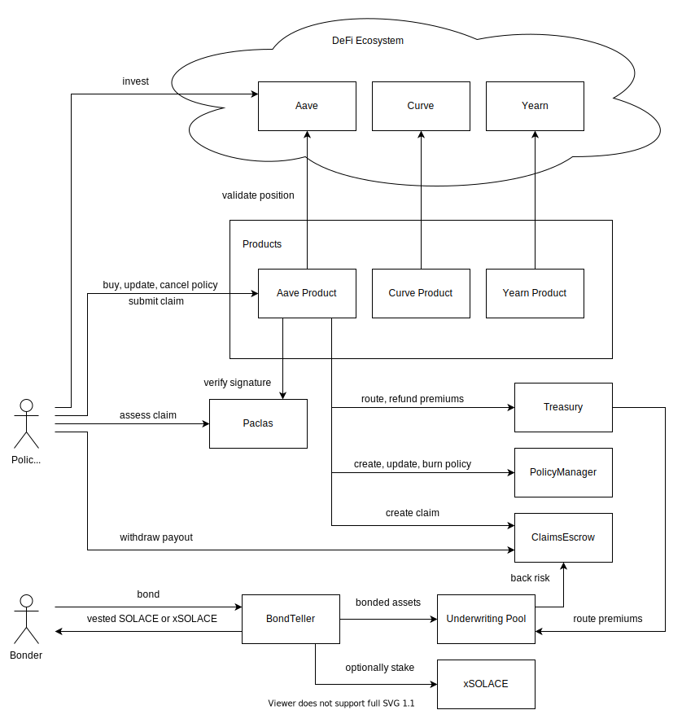

# solace.fi
https://solace.fi  

## Contracts
Detailed technical documentation is located at https://docs.solace.fi

## Deployments
See https://github.com/solace-fi/solace-core/releases or https://docs.solace.fi/docs/dev-docs/Contract%20Addresses for a list of contract addresses.

## Development Stack
* Solidity 0.8.6: https://docs.soliditylang.org/en/v0.8.6/
* Ethereum Dev Environment: https://hardhat.org/
* Smart Contract Testing: https://getwaffle.io/
* Blockchain interactions: https://docs.ethers.io/v5/
* TypeChain (TypeScript bindings for Ethereum smartcontracts): https://github.com/ethereum-ts/TypeChain
* TypeScript: https://www.typescriptlang.org/

## Style Guide
* Solidity: https://docs.soliditylang.org/en/v0.8.6/style-guide.html
* TypeScript: https://google.github.io/styleguide/tsguide.html
* Git: https://github.com/kseniya292/standards

## Installation
1. Clone this repo
2. Copy `.env.example` to `.env` and fill in the missing values. You'll need to sign up for API keys with various third party providers.
3. Install node.js v16 https://nodejs.org/
4. Run `npm install`
5. Run `npx hardhat compile`
6. Run `npx hardhat test`

## Local Deployment
1. Clone this repo
2. Copy `.env.example` to `.env` and fill in the missing values. You'll need to sign up for API keys with various third party providers.
3. Install node.js v16 https://nodejs.org/
4. Run `npm install`
5. Run `npx hardhat compile`

You can choose to fork mainnet or redeploy.

Forking:
1. In `.env` set `FORK_NETWORK=mainnet`
2. In `hardhat.config.ts` set `mainnet_fork.blockNumber` to a recent block.
3. Run `npx hardhat node`. Your local network will be available at `localhost:8545`.
4. See https://github.com/solace-fi/solace-core/releases or https://docs.solace.fi/docs/dev-docs/Contract%20Addresses for a list of contract addresses.

Redeploying:
1. In `.env` set `FORK_NETWORK=none`
2. Run `npx hardhat node`. Let this run and open a new terminal.
3. Run `npx hardhat run scripts/deploy-local-1.ts --network localhost`.
4. Run `npx hardhat run scripts/deploy-local-2.ts --network localhost`.
5. Your local network will be available at `localhost:8545`. See the outputs of the above commands for a list of contract addresses.

## Code Coverage
See https://share.solace.fi/test_coverage/index.html

## License
GNU General Public License v3.0
